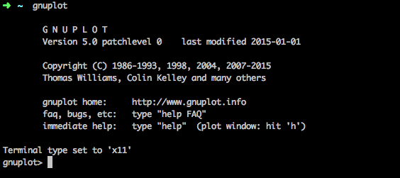
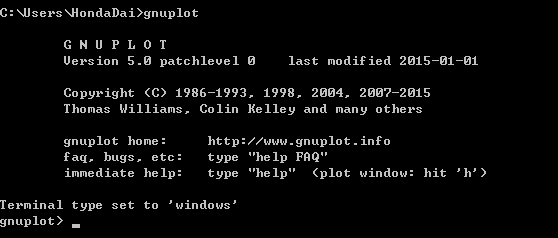

# GnuplotEditor

GnuplotEditor is a cross-platform and light editor for gnuplot. Help you write gnuplot script with intuition and minimal effort.

## Dependency

* JRE 1.7 or later
* Gnuplot

## Installation

Step 1: Install Gnuplot

```
Download Gnuplot from sourceforge (http://sourceforge.net/projects/gnuplot/files/gnuplot/)
```

**If you are using Windows, make sure your environment variable `Path` is including `C:\Program Files\gnuplot\bin`.**

Check installation is completed.

[Mac/Linux]



[Windows]



Step 2: Install GnuplotEditor

```
Download GnuplotEditor from 
```

Open `GnuplotEditor.sh (Max/Linux)` or `GnuplotEditor.bat (Windows)`

## Usage

Right Click to open menu.

Open File:

Working Directory:

Update Rate:

Export Source:

Export Image:


